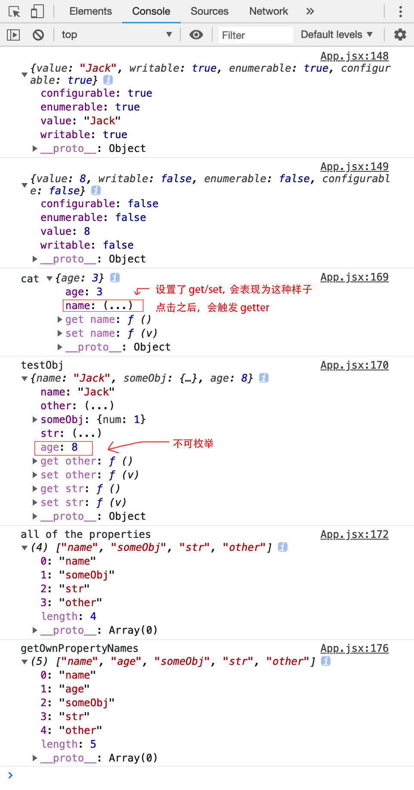

# Object.defineProperty初体验

> 首先是 [MDN](https://developer.mozilla.org/zh-CN/docs/Web/JavaScript/Reference/Global_Objects/Object/defineProperty#Creating_a_property) 的解释：
>
> `Object.defineProperty() `方法会直接在一个对象上定义一个新属性，或者修改一个对象的现有属性， 并返回这个对象。

对于 `Object.defineProperty` 早有耳闻，比如 `Vue` 就依赖此方法来实现数据响应。最近在 [ajax-hook](https://github.com/wendux/Ajax-hook) 中也发现了此方法的身影，于是也来探体验一番。

### 试验代码

```js
const cat = {
  name: 'Tom',
  age: 3
}
const testObj = {}

// configurable enumerable writable 都为 true
testObj.name = 'Jack'
// configurable enumerable writable 都为默认值 false
Object.defineProperty(testObj, 'age', {
  value: 8
})

console.log(Object.getOwnPropertyDescriptor(testObj, 'name'))
console.log(Object.getOwnPropertyDescriptor(testObj, 'age'))

// delete testObj.name // true
// delete testObj.age  // false

Object.defineProperty(testObj, 'someObj', {
  value: {
    num: 1
  },
  enumerable: true,
  configurable: true,
  writable: false
})

simpleSet(cat, 'name', 'nick')
simpleSet(testObj, 'str', 'test')
simpleSet(testObj, 'other', 'writable')
simpleSet(testObj, 'age', 18) // error

// testObj.age = 3              // not changed
// testObj.someObj = { num: 3 } // not changed
// testObj.someObj.num = 3      // changed..
// testObj.other = 3            // changed

console.log('cat', cat)
console.log('testObj', testObj)
// 不包含 age 属性
console.log('all of the properties', Object.keys(testObj)) // or use `for in`
// 返回一个由指定对象的所有自身属性的属性名组成的数组
// `包括不可枚举属性`，不包括Symbol值作为名称的属性
console.log('getOwnPropertyNames', Object.getOwnPropertyNames(testObj))

function simpleSet(obj, key, val) {
  let value = val
  Object.defineProperty(obj, key, {
    enumerable: true,
    configurable: true,
    get: function() {
      console.log('getter:', key, value)
      return value
    },
    set: function(v) {
      console.log('setter:', key, v)
      value = v
    }
  })
}
```

### 在 Chrome Console 中的样子



::: tip 几个比较重要的点：

- value 与 get, set 不可共存
- 一旦使用 `Object.defineProperty` 来定义属性，未配置的描述符将为默认值，与直接赋值不同
- `Object.defineProperty` 可以重新定义 `configurable` 为 `true` 的属性

:::
