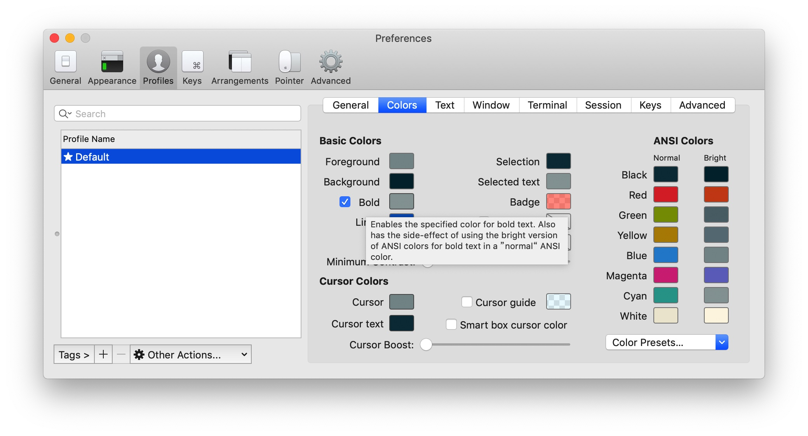
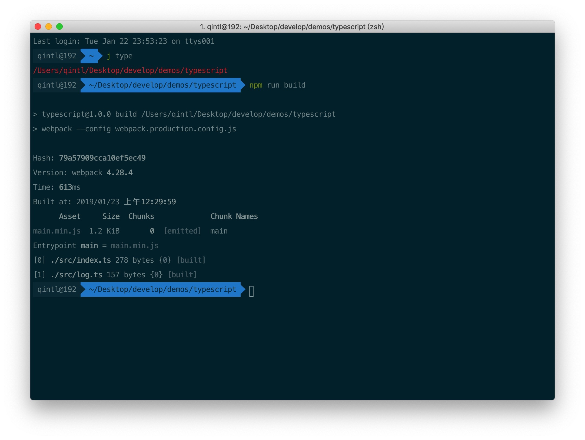
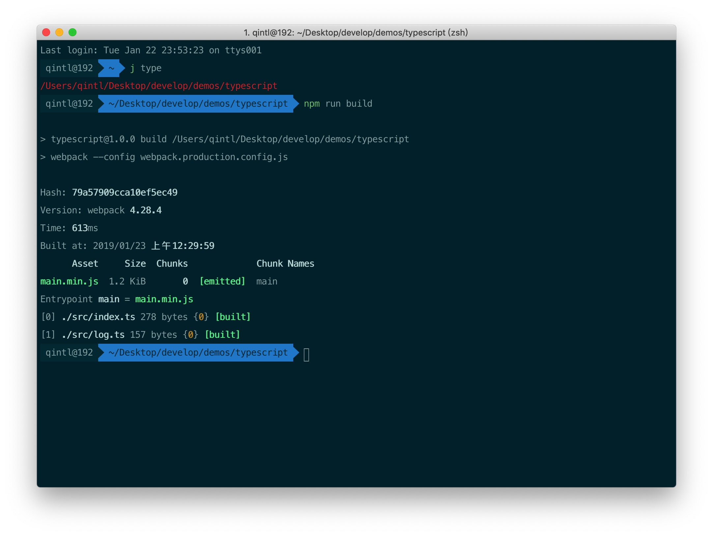

# iTerm2中使用Solarized主题的坑

> 最近发现自己的 iTerm2 无法正确高亮文本，经过一番探究后也是解决了这个问题，其中也学到了一些东西，在此记录一下

## 坑在哪里

- 根据 [iTerm2 主题配置](https://www.cnblogs.com/xishuai/p/mac-iterm2.html)，颜色配置使用了其中的 `Solarized Dark ` 
- iTerm2 配置中勾选下图所示选项



tip 的大致意思是为加粗的文本启用特殊的颜色，同时会有一个副作用(**带颜色的加粗文本将会使用 bright 颜色**)，

同时也可以看到导入的 `Solarized Dark` 颜色配置中，默认的 `bright` 颜色设置并不正确

在此设置下，将会导致所有加粗的文本将不能正确显示颜色，恢复正常显示也很简单，设置正确的 `bright color` 即可

## 入坑与出坑

最近在尝试使用 [typescript](https://www.tslang.cn/docs/home.html)， 期间偶然在 `vs code` 终端和 `iTerm2` 中都执行了 webpack 的打包命令，版本为  `v4.28.4` ，突然发现  `vs code` 的终端文本色彩正常，而 iTerm2 中的相关部分并没有相同的效果，使用系统自带的 terminal 测试后发现显示也没有问题，这就很蛋疼了


> 错误显示，不对比还没感觉，只是感觉信息不够明显



接下来就是喜闻乐见的 debug 阶段了，根据 log 中的 [emitted] 定位到了 `webpack/lib/Stats.js` 中，一番搜索后发现如下代码

```javascript
const defaultColors = {
  bold: "\u001b[1m",
  yellow: "\u001b[1m\u001b[33m",
  red: "\u001b[1m\u001b[31m",
  green: "\u001b[1m\u001b[32m",
  cyan: "\u001b[1m\u001b[36m",
  magenta: "\u001b[1m\u001b[35m"
};
```

这时候只想说 yangtuo.alias()

google 之后明白了其中的`\u001b[1m` 即代表文本加粗，手动将 1m 改为 0m 之后，颜色在 iTerm 中恢复了正常显示，**此处的 webpack 颜色配置正好完美触发了 iTerm 中设定加粗颜色之后副作用：为加粗文本使用了 `bright color`，从而暴露出了自身颜色配置不对的问题**

> 重新设置 `bright color` 之后 **没有对比就没有伤害**



更改后的高亮配置为 `Solarized Dark Higher Contrast` 有微调

## 更多资料

- [ANSI escape code](https://en.wikipedia.org/wiki/ANSI_escape_code#SGR_(Select_Graphic_Rendition)_parameters)
- [Build your own Command Line with ANSI escape codes](http://www.lihaoyi.com/post/BuildyourownCommandLinewithANSIescapecodes.html)
- [chalk](https://github.com/chalk/chalk)