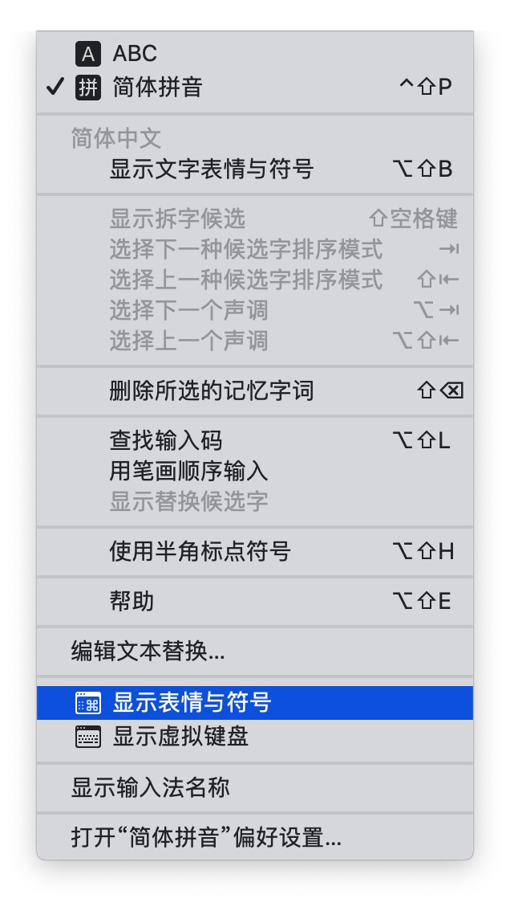
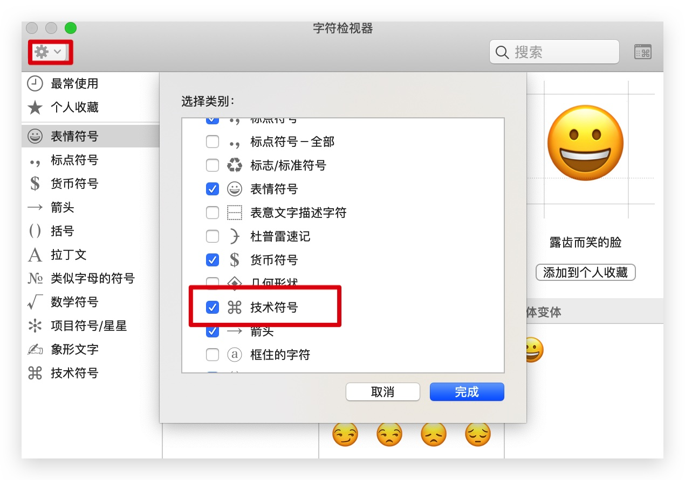

# make your mac work better

> 8102 年的小尾巴，我拥有了人生中的第一款  mac
>
> 整理一些实用的技巧分享给大家，不定时更新
>
> 

## 系统

> 使用 Mac 之前，花5分钟时间了解触控板的基本操作，绝对神器
>
> 发现一个有趣的功能：保持快速移动鼠标状态，指针会变大，不知道算不算彩蛋

- 触控板调整为触控取代点按
- dock 设置自动隐藏，大小可以根据个人喜好调整
- 自定义 dock 常用程序
- 根据个人需要设置触发角（鼠标移动到屏幕四角触发的动作）

## 常用快捷键

### 系统操作

| 功能         | 快捷键     |
| ------------ | ---------- |
| 应用切换全屏 | ⌃ + ⌘ + F  |
| 删除文件     | ⌘ + delete |
| 返回上级目录 | ⌘ + ↑      |
| 移动文件     | ⌘ + ⌥ + v  |

### chrome

| 功能                                       | 快捷键                              |
| ------------------------------------------ | ----------------------------------- |
| 打开新页签                                 | ⌘ + T                               |
| 打开新窗口（全屏状态下会新建一个全屏窗口） | ⌘ + N                               |
| 切换页签                                   | ⌘ +⌥ + → \| ⌘ + ⌥ + ← \| ⌘ + 数字键 |
| 关闭当前页签或窗口                         | ⌘ + W                               |
| 新标签打开链接                             | ⌘ + 单击 \| 鼠标中键                |

### iTerm2

| 功能       | 快捷键    |
| ---------- | --------- |
| 新建标签   | ⌘ + T     |
| 关闭标签   | ⌘ + W     |
| 切换全屏   | ⌘ + enter |
| 垂直分屏   | ⌘ + D     |
| 水平分屏   | ⌘ + ⇧ + D |
| 历史命令   | ⌘ + ;     |
| 清除当前行 | ⌃ + U     |
| 当前行置顶 | ⌃ + L     |
| 行首       | ⌃ + A     |
| 行尾       | ⌃ + E     |

### 输入特殊符号

| 功能                                           | 快捷键        |
| ---------------------------------------------- | ------------- |
|                                               | ⇧ + ⌥ + k     |
| ®                                              | ⌥ + R         |
| √                                              | ⌥ + V         |
| 打开特殊符号键盘（可以快速输入加入收藏的符号） | ⌃ + ⌘ + space |

### 添加 mac 键盘符号

> 截图工具 [Xnip](https://zh.xnipapp.com/)

## 构建开发环境

> - [mac-dev-setup](https://github.com/nicolashery/mac-dev-setup)
> - [配置 iTerm2 主题](https://www.cnblogs.com/xishuai/p/mac-iterm2.html)

## 软件推荐

> **安装软件如果提示未授权，右键程序, 之后按住 `⌃` ，同时点击打开即可进行安装**

- [typora](https://www.typora.io/) 写 markdown 神器，尤其是配合 **Touch Bar**
  - 复制链接后，选中要加链接的文字，直接按 🔗 按钮即可，非常方便
  - 点击 **段落** 可以快速插入片段（标题 引用 代码块 表格...）
- [IINA](https://lhc70000.github.io/iina/) 一款播放器
